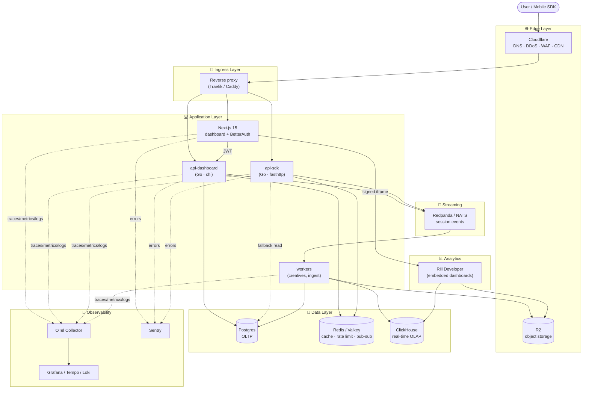

# BrandMoment — Target Infrastructure

Живой документ для выбора стека. Идём сверху вниз по слоям, для каждого:
- **зачем этот слой**
- **кандидаты** с честными trade-off
- **Decision:** ⬜ TBD / ✅ выбрано

Цель — **сбалансированная** система: не over-engineered для MVP, но без решений, которые придётся переписывать при росте.

---

## Target diagram (ideal state)

---

## Слой 1 · Edge (DNS / DDoS / CDN / Object Storage)

**Зачем:** первая линия защиты, TLS, кеш статики, хранилище creatives/Parquet.

| Кандидат | Плюсы | Минусы |
|---|---|---|
| **Cloudflare + R2** ⭐ | DDoS free, R2 zero-egress (критично для Rill!), Workers, простота | Vendor-lock (но экспорт ez) |
| AWS CloudFront + S3 | Tight AWS integration | Egress $$, сложнее |
| Fastly + Bunny | Быстрее edge, дешевле Cloudflare Pro | Нет equivalent R2, DDoS слабее |

**Мой совет:** Cloudflare + R2 — на нашем профиле (много чтений Parquet из Rill) zero egress экономит сотни долларов/мес сразу.

**Decision:** ⬜ ___

---

## Слой 2 · Ingress / Reverse Proxy

**Зачем:** один вход, маршрутизация на сервисы, TLS termination (если не на edge).

| Кандидат | Плюсы | Минусы |
|---|---|---|
| **Traefik** ⭐ | Auto-config из Docker/k8s labels, dashboard | JVM-like memory, чуть меньше возможностей на hardcore L7 |
| Caddy | Простейший конфиг, auto-TLS | Меньше плагинов |
| NGINX | Bulletproof, все про него знают | Ручной конфиг, reload с downtime |
| Envoy | Мощный, основа service mesh | Сложный, overkill для нас |
| **Нет reverse proxy** | Vercel/Fly.io делают роутинг сами | Vendor-lock |

**Мой совет:**
- **MVP на managed (Fly.io/Vercel):** без своего proxy, Cloudflare → provider → service.
- **Когда уйдём в k8s/VPS:** Traefik (auto-discovery экономит много боли).

**Decision:** ⬜ ___

---

## Слой 3 · Application Services

**Зачем:** бизнес-логика.

Разбивка на сервисы уже зафиксирована в spec:
- `apps/dashboard` — Next.js 15 (UI + BetterAuth)
- `services/api-dashboard` — Go (CRUD)
- `services/api-sdk` — Go (hot-path, позже)
- `services/workers` — Go (async jobs: creative validation, event ingestion)

**Go фреймворк — открытый выбор:**

| Кандидат | Плюсы | Минусы |
|---|---|---|
| **chi + net/http** ⭐ dashboard | Stdlib-compatible, идиоматично, простой | Руками больше писать |
| Fiber | Быстрее (fasthttp), Express-like API | Не совместим с net/http middleware |
| Gin | Популярный, много примеров | Возрастной, меньше развивается |
| **fasthttp + router** ⭐ sdk | Максимум throughput для hot-path | Несовместим с net/http ecosystem |

**Мой совет:** `chi` для dashboard (idiomatic Go), `fasthttp` для sdk когда придёт (там каждая микросекунда считается).

**Decision (dashboard):** ⬜ ___
**Decision (sdk):** ⬜ ___

---

## Слой 4 · OLTP Database (Postgres)

**Зачем:** orgs, users, campaigns, rules, creatives metadata — всё что требует транзакций.

| Кандидат | Плюсы | Минусы |
|---|---|---|
| **Neon** ⭐ | Serverless, branching для preview envs, generous free tier | Cold starts (минимизируются) |
| Supabase | Auth/Storage в комплекте | Если не берём их Auth — overkill |
| AWS RDS / Aurora | Battle-tested | Дорого, DevOps |
| Self-hosted Postgres | Контроль, дёшево на масштабе | DevOps, backups, HA сами |

**Postgres extensions, которые пригодятся:**
- `pgvector` — embeddings для AI matching (v2)
- `pg_stat_statements` — perf tuning
- `pgcrypto` — argon2 для API keys

**Мой совет:** **Neon** на MVP (preview branches для PR = магия), self-hosted через 6-12 мес если захочется.

**Decision:** ⬜ ___

---

## Слой 5 · Cache / Fast K-V (Redis family)

**Зачем:** API key validation на hot-path, rate limiting, sessions, queues, pub-sub инвалидации кеша.

| Кандидат | Плюсы | Минусы |
|---|---|---|
| **Upstash** ⭐ MVP | Serverless, pay-per-request, free tier | Latency чуть выше (HTTPS) |
| Valkey (self-hosted) | Open Redis fork, бесплатно | DevOps |
| Dragonfly | 25x faster, Redis-compatible | Новый, community меньше |
| Redis Cloud | Официальный managed | После смены лицензии 2024 — спорный |
| AWS ElastiCache | Managed на AWS | AWS-lock |

**Мой совет:** **Upstash** на MVP → **Dragonfly/Valkey** когда nagрузка уйдёт за $50/мес на Upstash.

**Decision:** ⬜ ___

---

## Слой 6 · Object Storage (creatives + Parquet)

**Зачем:** HTML5 creatives, session events в Parquet, backups.

| Кандидат | Плюсы | Минусы |
|---|---|---|
| **Cloudflare R2** ⭐ | S3 API, **zero egress**, дёшевый storage | Чуть медленнее S3 |
| AWS S3 | Эталон, все интегрируется | Egress $$ |
| Backblaze B2 | Очень дёшево | Меньше регионов |
| MinIO (self-hosted) | Контроль, S3 API | DevOps |

**Мой совет:** R2 — единственный выбор при нашем профиле Rill. MinIO только для local dev в docker-compose.

**Decision:** ⬜ ___

---

## Слой 7 · Streaming / Events bus

**Зачем:** буфер между SDK и consumers (S3 writer, ClickHouse ingester, ML, fraud).

| Кандидат | Плюсы | Минусы | Когда |
|---|---|---|---|
| **Batched writes в S3** | Ничего не поднимать | Latency 1-5 мин, нет replay | v1 MVP |
| **Redpanda** ⭐ | Kafka API, без JVM, single binary | Небольшая community vs Kafka | v2 (SDK live) |
| NATS JetStream | Сверх-лёгкий, Go-native | Меньше tooling для analytics | альтернатива |
| Kafka (MSK/Confluent) | Gold standard | Сложно, JVM, $$$ | когда >100k events/sec |
| AWS Kinesis | Managed | AWS-lock, платишь за shards | если уже в AWS |

**Мой совет:**
- **v1:** batched writes в R2 (Go writer в `workers/`, flush каждые 30 сек).
- **v2 (SDK live):** Redpanda — Kafka-compatible даёт путь к росту без rewrite.

**Decision v1:** ⬜ ___
**Decision v2:** ⬜ ___

---

## Слой 8 · OLAP / Analytics

**Зачем:** агрегаты по миллиардам строк session events.

| Кандидат | Плюсы | Минусы | Когда |
|---|---|---|---|
| **DuckDB через Rill** ⭐ v1 | Zero ops, читает Parquet из S3 | Не для real-time, single-node | MVP |
| **ClickHouse** ⭐ v2 | Gold standard OLAP, real-time | Жрёт RAM, сложная эксплуатация | Когда нужен live dashboard |
| TimescaleDB | Просто Postgres extension, нет отдельной БД | Медленнее ClickHouse на 10x+ |  |
| Druid / Pinot | Specialized, быстрые | Over-engineered для нас |  |

**Мой совет:**
- **v1:** только DuckDB+Parquet в Rill.
- **v2:** добавить **ClickHouse Cloud** (managed, serverless) когда потребуется <1 мин latency на дашбордах.

**Decision v1:** ⬜ ___
**Decision v2:** ⬜ ___

---

## Слой 9 · Embedded BI / Dashboarding

**Зачем:** pre-built analytics UI для publisher/brand views, меньше кода самим.

| Кандидат | Плюсы | Минусы |
|---|---|---|
| **Rill Developer** ⭐ (self-hosted) | Zero vendor-lock, DuckDB native, YAML-driven dashboards | Self-host = DevOps |
| Rill Cloud | Managed | $$, vendor-lock |
| Metabase | Open, популярный | Медленный на больших данных |
| Superset | Mature, enterprise | Python-heavy, сложный |
| Сами на Recharts/Tremor | Полный контроль | Х3 работы |

**Decision:** ✅ **Rill Developer self-hosted** (зафиксировано в spec)

---

## Слой 10 · Auth

**Зачем:** login, orgs, roles, invites, sessions.

| Кандидат | Плюсы | Минусы |
|---|---|---|
| **BetterAuth** ⭐ | Self-hosted, orgs plugin, no lock-in | Молодой |
| Clerk | Turnkey, лучший DX | $$, lock-in |
| WorkOS | Enterprise SSO | $125+/мес |
| Supabase Auth | Free tier | Orgs руками |
| Auth0 | Mature | Дорого, legacy UX |

**Decision:** ✅ **BetterAuth** (зафиксировано в spec)

---

## Слой 11 · Observability

**Зачем:** traces / metrics / logs / errors — отладка и алёрты.

| Подслой | Кандидаты | Совет |
|---|---|---|
| Tracing | Jaeger · **Tempo** · Honeycomb | Tempo (Grafana стек) |
| Metrics | **Prometheus** · VictoriaMetrics | Prometheus-compatible |
| Logs | **Loki** · Elasticsearch · Axiom | Loki (дёшево, Grafana-интегрирован) |
| Errors | **Sentry** · GlitchTip | Sentry (бесплатный tier щедрый) |
| Product analytics | **PostHog** · Mixpanel | PostHog (self-host opt) |
| Umbrella | **Grafana Cloud** ⭐ · SigNoz (self-host) · Datadog ($$$) | Grafana Cloud: free 10k series |

**Мой совет:** **Grafana Cloud** (Tempo + Mimir + Loki) + **Sentry** + **PostHog**. Всё через OTel-collector в одной точке.

**Decision:** ⬜ ___

---

## Слой 12 · CI/CD + Hosting

**Зачем:** build, test, deploy.

| Компонент | Кандидаты | Совет |
|---|---|---|
| Version control | GitHub / GitLab / Forgejo | GitHub (community) |
| CI | GitHub Actions · Dagger · BuildKite | Actions (бесплатно для public, дёшево для private) |
| Docker registry | GHCR · Docker Hub · ECR | GHCR (идёт с Actions) |
| UI hosting | **Vercel** · Cloudflare Pages · Netlify · self-host | Vercel (Next-native) или CF Pages (cheaper) |
| API hosting | **Fly.io** · Railway · Render · AWS ECS · k8s | Fly.io (globally распределённый, дёшев) |
| Managed Postgres | **Neon** · Supabase · RDS · Crunchy Bridge | Neon (branching) |
| Secrets | Doppler · Infisical · AWS SM · **1Password + env** | 1Password CLI для начала |

**Три типовые связки для BrandMoment:**

### Option A — "Максимально быстро стартуем"
Cloudflare + Vercel (UI) + Fly.io (Go API) + Neon (PG) + Upstash (Redis) + R2 + Rill на Fly → **Grafana Cloud + Sentry**.
Стоимость: ~$0-50/мес до traction.

### Option B — "AWS-native"
CloudFront + S3 + ECS Fargate + RDS + ElastiCache + MSK → CloudWatch (+ Grafana поверх).
Стоимость: $300+/мес даже в idle. DevOps тяжелее.

### Option C — "Self-hosted k8s (Hetzner)"
Hetzner (CCX dedicated) + k3s + Traefik + Longhorn + Postgres Operator + Valkey + MinIO → self-hosted Grafana stack.
Стоимость: ~$50-150/мес на прилично железе, но DevOps время.

**Мой совет:** **Option A** сейчас, через 12-18 мес эвалуация Option C для cost optimization.

**Decision:** ⬜ ___

---

## Решения, уже зафиксированные в spec

| Слой | Выбор |
|---|---|
| Backend язык | ✅ Go |
| UI framework | ✅ Next.js 15 + React 19 |
| UI kit | ✅ Tailwind v4 + shadcn/ui |
| Auth | ✅ BetterAuth |
| Embedded BI | ✅ Rill Developer self-hosted |
| Data format | ✅ Postgres + Parquet в S3/R2 |
| Repo | ✅ Turborepo monorepo |
| Tenancy | ✅ Multi-tenant (admin + publisher + brand) |
| i18n | ✅ English only (v1) |
| Observability | ✅ OpenTelemetry с нуля |

---

## Открытые вопросы (над чем думаем сейчас)

1. ⬜ **Edge/CDN** — Cloudflare подтверждаем?
2. ⬜ **Hosting pattern** — Option A (managed) / B (AWS) / C (self-host k8s)?
3. ⬜ **Managed Postgres** — Neon? Supabase? Self-host?
4. ⬜ **Redis/Valkey** — Upstash на MVP?
5. ⬜ **Streaming v2** — Redpanda vs NATS JetStream?
6. ⬜ **OLAP v2** — ClickHouse Cloud vs self-host?
7. ⬜ **Observability stack** — Grafana Cloud vs SigNoz self-host?
8. ⬜ **Go framework** — chi (dashboard) + fasthttp (sdk)?
9. ⬜ **Reverse proxy** — Traefik / Caddy / без (managed делают)?

---

## Порядок решений (предлагаю)

Есть **5 "upstream" решений**, которые определяют всё остальное:

1. **Hosting pattern** (§12) → определяет многое ниже.
2. **Edge/CDN** (§1) → почти наверняка Cloudflare.
3. **Managed Postgres** (§4) → Neon выигрывает для Option A.
4. **Redis provider** (§5) → Upstash для MVP.
5. **Observability umbrella** (§11) → Grafana Cloud.

Остальное (reverse proxy, streaming v2, OLAP v2) можно отложить — это решения 3-6 месяцев вперёд, не блокируют старт.

**Что обсуждаем первым?**
